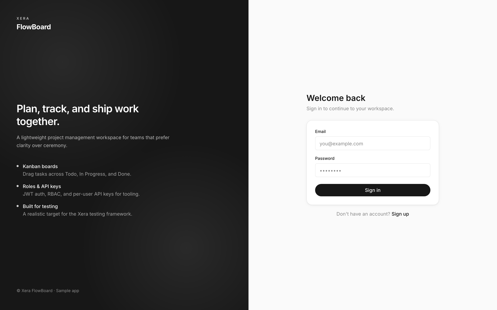
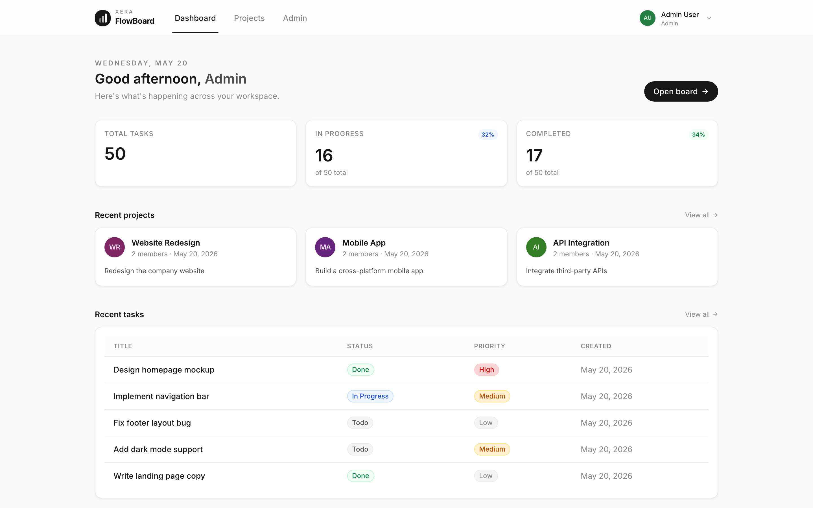
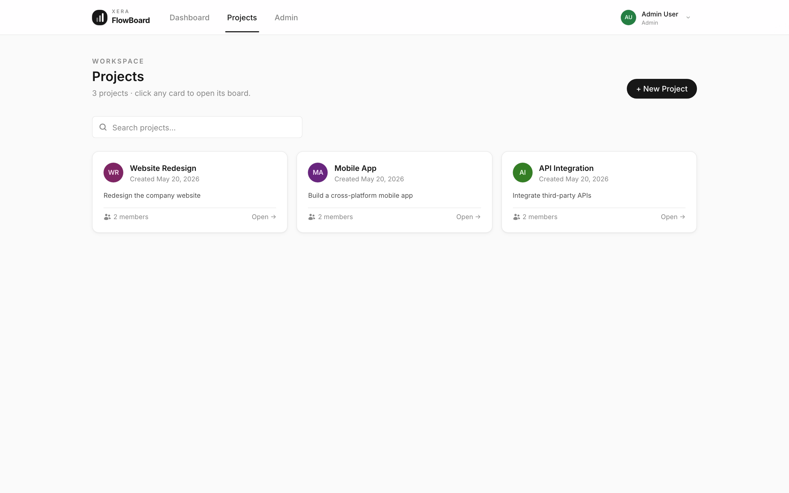
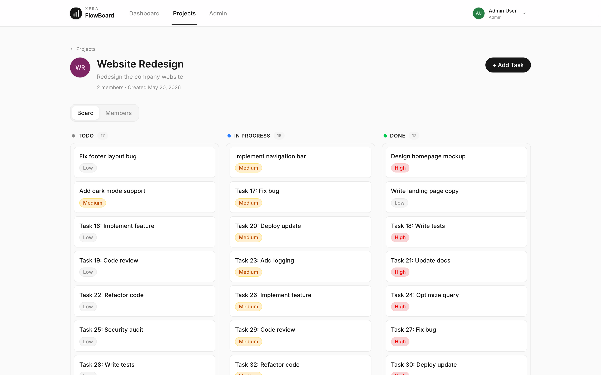
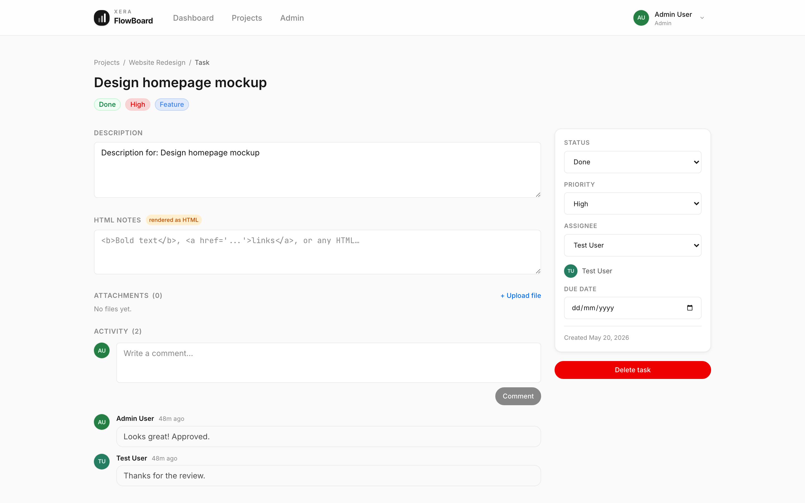
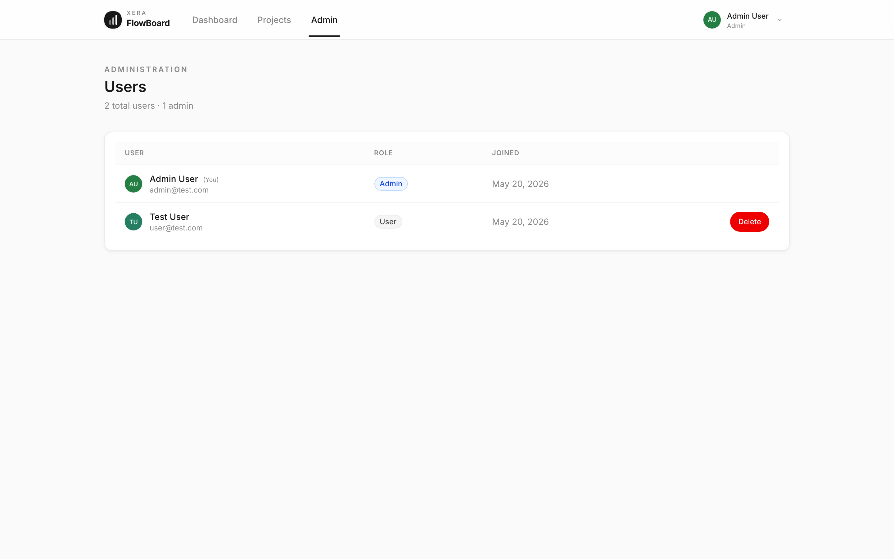

# Xera FlowBoard — Sample App

> A realistic full-stack project management application built as the **official sample target** for the [Xera](https://github.com/xera-ai/xera) testing framework.

Xera FlowBoard is a production-like app with real authentication, RBAC, a REST API, file uploads, and intentional security surfaces — giving Xera a meaningful target for UI, API, security, and performance testing.

---

## Screenshots

| Sign in | Dashboard |
|---|---|
|  |  |

| Projects | Kanban board |
|---|---|
|  |  |

| Task detail | Admin · Users |
|---|---|
|  |  |

Regenerate after UI changes (Playwright is intentionally not a dependency — install on demand):

```bash
npm i --no-save playwright && npx playwright install chromium
npm run dev:backend & npm run dev:frontend &  # both must be running
npm run screenshots
```

---

## Getting Started

```bash
git clone https://github.com/xera-ai/xera-sample-app
cd xera-sample-app
npm install
npm run dev:backend   # API → http://localhost:3000
npm run dev:frontend  # UI  → http://localhost:5173
```

The database is created and seeded automatically on first boot.

**Test accounts:**

| Role  | Email             | Password   |
|-------|-------------------|------------|
| Admin | `admin@test.com`  | `admin123` |
| User  | `user@test.com`   | `user123`  |

**Reset to initial state at any time:**
```bash
curl -X POST http://localhost:3000/api/v1/seed
```

---

## Running with Docker

### Option A — Pull prebuilt images from GHCR (no build)

```bash
curl -O https://raw.githubusercontent.com/xera-ai/xera-sample-app/main/docker-compose.prod.yml
docker compose -f docker-compose.prod.yml up -d
```

Pin a specific version with `TAG=v1.2.3 docker compose -f docker-compose.prod.yml up -d`.

Images (public, multi-arch `linux/amd64` + `linux/arm64`):
- `ghcr.io/xera-ai/xera-sample-app-backend`
- `ghcr.io/xera-ai/xera-sample-app-frontend`

### Option B — Build locally

```bash
docker compose up --build
```

- UI: http://localhost:8080
- API: http://localhost:3000

Set `AUTO_SEED=false` in `docker-compose.yml` to start with an empty database.

---

## Stack

| Layer    | Technology |
|----------|-----------|
| Runtime  | Node.js 22 |
| API      | Fastify 5 · TypeScript |
| Database | SQLite · Drizzle ORM |
| Auth     | JWT (access + refresh) · API Key (`X-API-Key`) |
| Frontend | React 19 · Vite 8 · Tailwind CSS v4 |
| Infra    | Docker · nginx |

---

## API

**Base URL:** `http://localhost:3000/api/v1`  
**Swagger UI:** http://localhost:3000/docs  
**OpenAPI JSON:** http://localhost:3000/docs/json

### Auth
```
POST   /auth/register
POST   /auth/login
POST   /auth/refresh
POST   /auth/logout
GET    /auth/me
```

### Projects
```
GET    /projects
POST   /projects
GET    /projects/:id
PATCH  /projects/:id
DELETE /projects/:id
GET    /projects/:id/members
POST   /projects/:id/members
DELETE /projects/:id/members/:userId
GET    /projects/:id/tasks
POST   /projects/:id/tasks
GET    /projects/:id/labels
POST   /projects/:id/labels
```

### Tasks
```
GET    /tasks/:id
PATCH  /tasks/:id
DELETE /tasks/:id
GET    /tasks/:id/comments
POST   /tasks/:id/comments
GET    /tasks/:id/attachments
POST   /tasks/:id/attachments
```

### Other
```
PATCH  /comments/:id
DELETE /comments/:id
GET    /attachments/:id/download
DELETE /attachments/:id
GET    /users             (admin only)
PATCH  /users/:id         (admin only)
DELETE /users/:id         (admin only)
GET    /api-keys
POST   /api-keys
DELETE /api-keys/:id
GET    /health
GET    /metrics
POST   /seed
```

---

## UI Pages

| Page | URL | Access |
|------|-----|--------|
| Login | `/login` | Public |
| Register | `/register` | Public |
| Dashboard | `/` | Authenticated |
| Projects | `/projects` | Authenticated |
| Kanban Board | `/projects/:id` | Member |
| Task Detail | `/tasks/:id` | Member |
| API Keys | `/settings/api-keys` | Authenticated |
| Profile | `/settings/profile` | Authenticated |
| Admin Panel | `/admin/users` | Admin only |

---

## Testing Surfaces

Xera FlowBoard is deliberately built with features that exercise common test scenarios:

| Surface | Location | What to test |
|---------|----------|--------------|
| JWT auth | All protected routes | Token expiry, forged signatures, `alg:none` |
| API Key auth | `X-API-Key` header | Key revocation, privilege scope |
| RBAC | Projects, Users, Comments | Horizontal + vertical privilege escalation |
| Stored XSS | Task HTML Notes (`dangerouslySetInnerHTML`) | CSP, sanitization |
| File upload | Task Attachments | MIME bypass, path traversal, size limits |
| Rate limiting | `POST /auth/login` (20/min), all routes (500/min) | Throttling behavior |
| SQL injection | `?search=` params | Parameterized query validation |
| Pagination | All list endpoints | `?page=&limit=` |
| Cascade delete | Delete project/task | Referential integrity |

See [`docs/testing-guide.md`](docs/testing-guide.md) for detailed test scenarios and curl examples.  
See [`docs/user-stories.md`](docs/user-stories.md) for full user stories and acceptance criteria.

---

## Seed Data

After seeding, the following fixed IDs are available for scripted tests:

| Resource | IDs |
|----------|-----|
| Users | `user-admin`, `user-1` |
| Projects | `project-1`, `project-2`, `project-3` |
| Tasks | `task-1` … `task-15` (named) + 135 auto-generated |
| Comments | `comment-1` … `comment-10` |
| Labels | `label-1` … `label-6` |

---

## Project Structure

```
xera-sample-app/
├── backend/
│   └── src/
│       ├── db/          # Schema, migrations, Drizzle client
│       ├── lib/         # Seed, project access helpers
│       ├── middleware/  # JWT + API Key authentication
│       ├── plugins/     # CORS, rate-limit, Swagger, auth
│       └── routes/      # auth, projects, tasks, comments,
│                        # labels, attachments, users, api-keys,
│                        # seed, health, metrics
├── frontend/
│   └── src/
│       ├── components/  # ui/, app/ (NavBar, modals)
│       ├── pages/       # LoginPage, RegisterPage, DashboardPage,
│       │                # ProjectsPage, ProjectDetailPage,
│       │                # TaskDetailPage, AdminUsersPage, ...
│       ├── store/       # Zustand auth store
│       └── lib/         # Axios API client
├── docs/
│   ├── testing-guide.md
│   └── user-stories.md
├── docker-compose.yml
└── AGENTS.md            # Context for AI agents working in this repo
```

---

## Related

- **Xera framework:** https://github.com/xera-ai/xera
